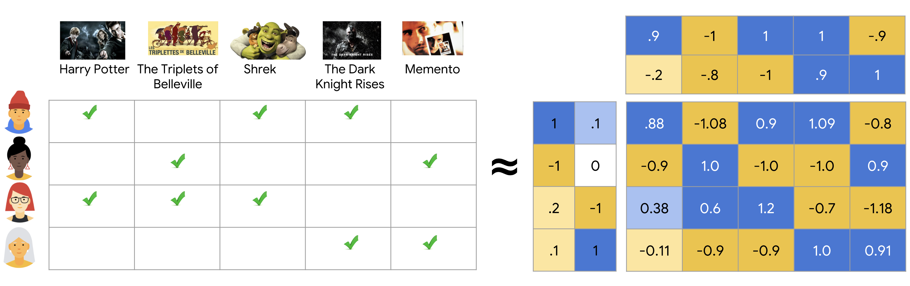
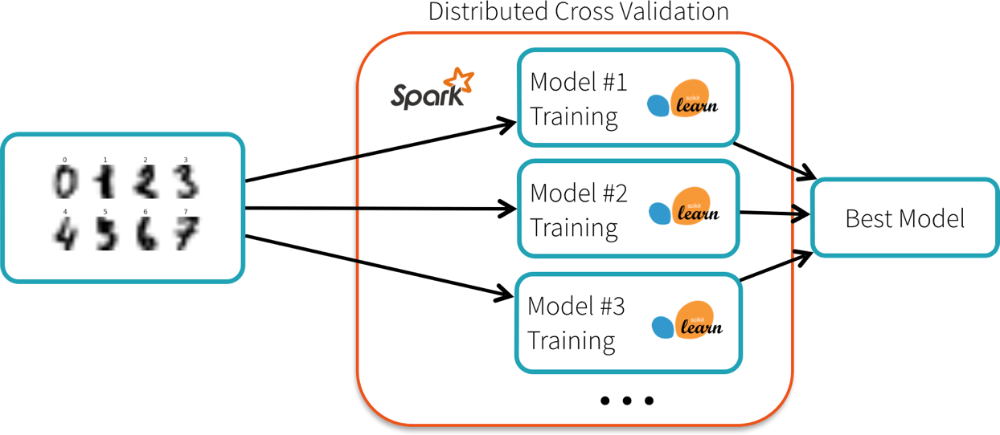

# Deep Learning Recommendation System with Spark Training
A recommendation system is an artificial intelligence or AI algorithm, usually associated with
machine learning, that uses data to suggest or recommend additional products to consumers.
These can be based on various criteria, including past purchases, search history, demographic
information, and other factors.

One such example is Matrix factorization is a technique used in collaborative filtering-based recommendation systems.
It aims to decompose a user-item interaction matrix into two lower-rank matrices, representing
user and item embeddings. The underlying assumption is that the latent factors in these embeddings
capture the inherent characteristics and preferences of users and items.

## Matrix Factorization

 Matrix factorization can be integrated into a recommendation engine by using neural networks to learn the embeddings.
 The user and item indices are passed through embedding layers, which map them to low-dimensional latent spaces.
 These embeddings are then combined and processed through additional layers to predict the user's preference or
 rating for a particular item.

By leveraging deep learning techniques, such as non-linear activations, regularization, learning rate schedules,
and different optimizers, the model can learn complex patterns and dependencies present in the user-item interactions.
This allows for more accurate and personalized recommendations, as the model can capture intricate relationships
between users and items that may not be captured by traditional matrix factorization methods.

## Spark Distributed Model Training

Training a deep learning matrix factorization recommendation engine with Apache Spark offers numerous
benefits. Firstly, Apache Spark provides a distributed computing framework, allowing the training
process to leverage the power of a cluster of machines, enabling faster and scalable training. This
scalability is crucial when dealing with large datasets and complex models. Secondly, Apache Spark's
built-in support for data preprocessing and transformation tasks simplifies the data preparation process,
ensuring efficient feature engineering for the recommendation engine.

Additionally, Spark's integration with popular deep learning libraries like TensorFlow and PyTorch
enables seamless integration of deep learning algorithms into the recommendation system. The combination
of Spark's distributed computing capabilities and deep learning frameworks optimizes the training process,
leading to more accurate and effective recommendations.  Overall, training a deep learning matrix
factorization recommendation engine with Apache Spark enhances performance, scalability, and productivity,
enabling the development of high-quality recommendation systems at scale.

## Special Note
Spark is able to deal with much bigger work loads than most options. If your data is larger than 1TB,
Spark is probably the way to go. However, [Dask](https://www.dask.org/) might also not be the best
suited tool for the project. There are other Pythonic solutions for Big Data, such as[Ray](https://www.ray.io/) and
[Modin](https://modin.readthedocs.io/en/stable/), [Vaex](https://vaex.io/) and [Rapids](https://rapids.ai/); all have their
pros and cons. But with more than 1TB of data, Spark is probably the best option.

## Literature and Inspiration
* [An Introduction to Recommender Systems (+9 Easy Examples)](https://www.iteratorshq.com/blog/an-introduction-recommender-systems-9-easy-examples/)
* [An In-Depth Guide to How Recommender Systems Work](https://builtin.com/data-science/recommender-systems)
* [Matrix Factorization for Recommender Systems](https://www.diva-portal.org/smash/get/diva2:633561/FULLTEXT01.pdf)
* [Matrix Factorization Techniques for Recommender Systems](https://www.asc.ohio-state.edu/statistics/dmsl//Koren_2009.pdf)
* [An Introduction to Distributed Deep Learning](http://seba1511.net/dist_blog/)
* [HOGWILD!: A Lock-Free Approach to Parallelizing Stochastic Gradient Descent](https://arxiv.org/pdf/1106.5730.pdf)
* [Scaling Distributed Machine Learning with the Parameter Server](https://www.cs.cmu.edu/~muli/file/parameter_server_osdi14.pdf)
